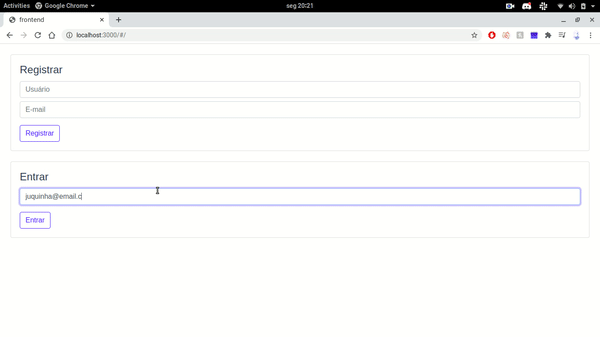
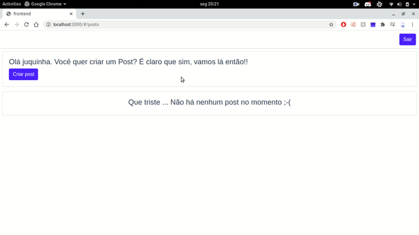
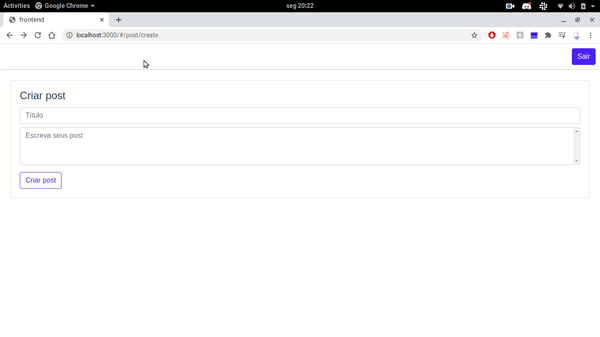

# Fatec Blog
- Jason Carneiro
- Marcos Toledo

## Contexto aplicação
Este aplicação consiste em um mini-blog, onde é possível criar usuários, posts e comentários.

Todas as rotas estão contidas no arquivo `Fatec-blog.postman_collection`. Você pode importar no Postman para visualizar.

##Em ação





## Tecnologias
- Java 11
- Spring Boot
- Docker & Docker compose
- MySQL
- Vue.js 2.x

## Rodando a aplicação backend

É necessário ter instalado o make

Abra uma aba no terminal e execute:

```bash
make db/up
make dev
```

Abra outra aba e execute:

```bash
make run
```

Agora a aplicação está rodando na porta 8080.

## Rodando aplicação frontend

É necessário instalar todas as dependências executando:

```bash
yarn install
```

Execute a aplicação passando a porta:

```bash
PORT=3000 yarn dev
```
